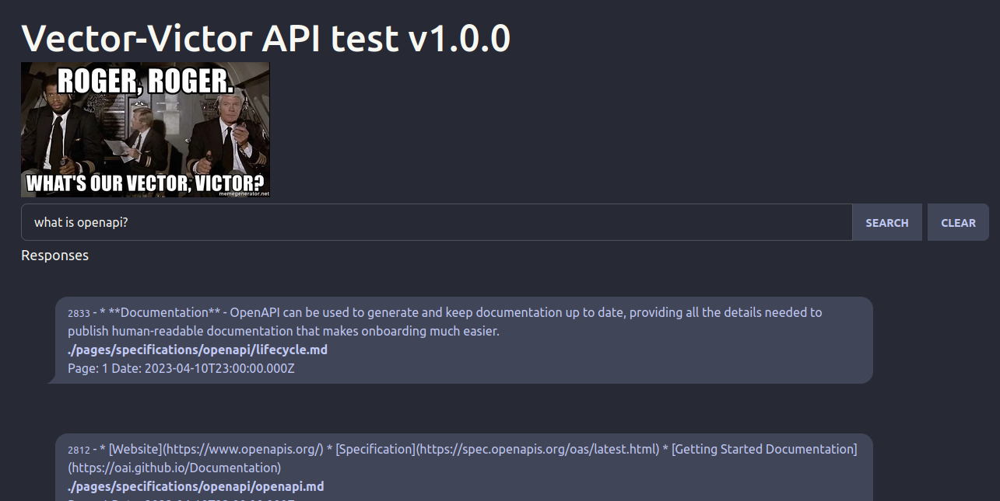

# Vector-Victor

## SQL tables needed

* See `tables-*.sql`

## Included scripts

* create embeddings using OpenAI API (`importFile.js` and `importBlog.js`)
* cache queries and search by cosine affinity (`query.js`)
* link queries to prompts to correct errors (`link.js`)

## TODO

* Allow to run with `sqlite-vss` as well as Postgres and `pgvector` extension
